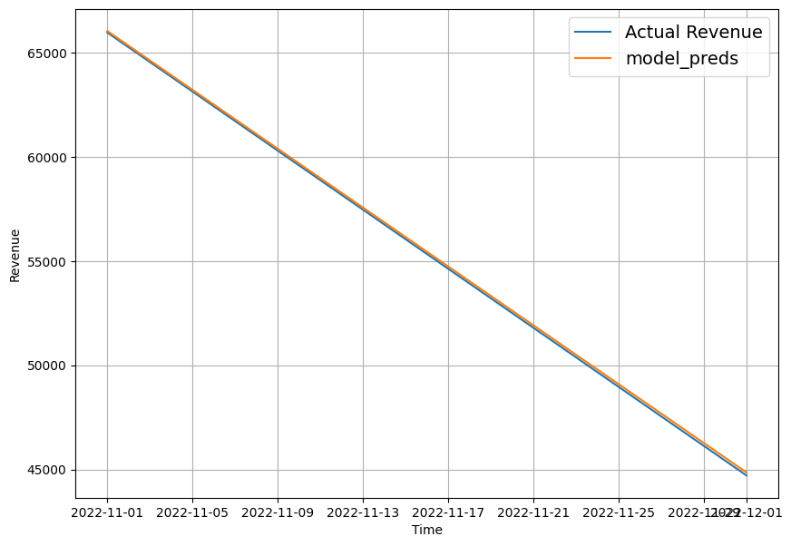

# Revenue Prediction

## NON-TECHNICAL EXPLANATION
This model is a neural network trained on historical revenue for a single client, the aim of this model is to be able to make predictions on what the future revenue would be.

Successful results from the model could help for this method of making revenue predictions to be replicated in the process of other clients, and help the company make better decisions on financial related matters.

## DATA
The data used for this model is the historical data from the company database, all data are real and not fabricated.

## MODEL 
The model is a neural network machine learning model, this model was picked because neural networks seemed suitable for this project.

## HYPERPARAMETER OPTIMSATION

This model has two hyperparameters:
1. Number of unites in dense layer
    * Range: from 8 to 64, in steps of 8
2. The optimizer for the model
    * Choices: Adam, RMSprop, SGD

An instance of kt.GridSearch is created to perform grid search over the defined hyperparameter space.

## RESULTS

